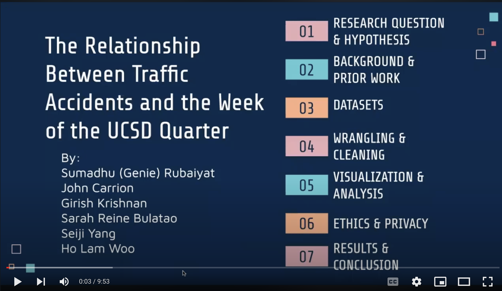

# COGS 108 Summer Session I 2023 - Group 16

## The Relationship Between Traffic Collisions and the Week of the UCSD Quarter

**Team Members:**

- Sumadhu Rubaiyat
- John Carrion
- Girish Krishnan
- Sarah Reine Bulatao
- Seiji Yang
- Ho Lam Woo 

## Video Presentation

Click on the image below to watch our video presentation!

__Link: https://youtu.be/cd2Xpc9-KHE__

  

## Jupyter Notebooks

* **FinalProject_group016.ipynb**: Contains our final project code and report.
* **EDACheckpoint_group016.ipynb**: Contains our Exploratory Data Analysis checkpoint.
* **DataCheckpoint_group016.ipynb**: Contains our Data Cleaning and Wrangling checkpoint.
  
